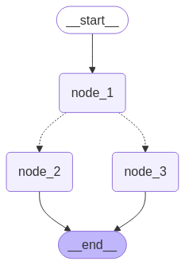

# LangGraph - Building AI Agents with State Graphs

This project introduces **LangGraph**, a powerful framework for building stateful, multi-actor applications with LLMs. Learn to create AI agents that can reason, use tools, maintain memory, and make decisions through graph-based workflows.

## 📁 Project Structure

```
3_LangGraph/
├── 1_SimpleGraph.ipynb                                    # Basic graph with conditional routing
├── 1_SimpleGraph.py                                       # Standalone Python script
├── 2_SimpleGraph_with_Reasoning_&_Tools.ipynb            # Agent with tool calling
├── 2_SimpleGraph_with_Reasoning_&_Tools.py               # Standalone Python script
├── 3_SimpleGraph_with_Reasoning_&_Tools_&_Memory.ipynb   # Agent with persistent memory
├── 3_SimpleGraph_with_Reasoning_&_Tools_&_Memory.py      # Standalone Python script
├── images/                                                # Generated graph visualizations
│   ├── arithmetic.png
│   ├── mermaid_image.png
│   └── Screenshots
└── requirements.txt
```

## 🎯 What You'll Learn

### 1. **Graph Fundamentals**
- Building stateful workflows with nodes and edges
- Conditional routing between nodes
- State management and propagation
- Visualizing graph structures

### 2. **Tool Integration (ReAct Pattern)**
- Binding tools to LLMs
- Automatic tool selection and execution
- Building reasoning agents
- Tool nodes and conditional edges

### 3. **Memory & Persistence**
- Implementing conversation memory
- Thread-based state management
- Checkpointing for long-running agents
- Context retention across multiple interactions

## 📚 Progressive Learning Path

### Level 1: Simple Graph (Foundation)
**Files**: `1_SimpleGraph.ipynb`, `1_SimpleGraph.py`

Learn the basics of LangGraph by building a simple state machine.

#### Key Concepts:
- **State**: TypedDict defining what data flows through the graph
- **Nodes**: Functions that process state and return updates
- **Edges**: Connections between nodes (regular & conditional)
- **START/END**: Special nodes marking entry and exit points

#### Code Example:

```python
from langgraph.graph import StateGraph, START, END
from typing_extensions import TypedDict
from typing import Literal

# Define state structure
class state(TypedDict):
    graph_state: str

# Create nodes
def node_1(state):
    print("---Node 1---")
    return {"graph_state": state["graph_state"] + ": 1"}

def node_2(state):
    print("---Node 2---")
    return {"graph_state": state["graph_state"] + ": 2"}

def node_3(state):
    print("---Node 3---")
    return {"graph_state": state["graph_state"] + ": 3"}

# Conditional routing
def decide_next(state) -> Literal["node_2", "node_3"]:
    print("---Decide Next---")
    if random.random() < 0.5:
        return "node_2"
    return "node_3"

# Build graph
builder = StateGraph(state)
builder.add_node("node_1", node_1)
builder.add_node("node_2", node_2)
builder.add_node("node_3", node_3)

# Define flow
builder.add_edge(START, "node_1")
builder.add_conditional_edges("node_1", decide_next)
builder.add_edge("node_2", END)
builder.add_edge("node_3", END)

# Compile and run
graph = builder.compile()
result = graph.invoke({"graph_state": "Please show a number -"})
```

#### Output:
```
---Node 1---
---Decide Next---
---Node 2---
{'graph_state': 'Please show a number -: 1: 2'}
```

#### Visualization:
The graph automatically generates a Mermaid diagram showing the flow structure.



---

### Level 2: Graph with Reasoning & Tools (ReAct Agent)
**Files**: `2_SimpleGraph_with_Reasoning_&_Tools.ipynb`, `2_SimpleGraph_with_Reasoning_&_Tools.py`

Build an **arithmetic AI agent** that can reason about which tool to use and execute calculations.

#### Key Concepts:
- **Tool Binding**: Connecting functions as tools for the LLM
- **ReAct Pattern**: Reasoning + Acting (think, then use tool)
- **ToolNode**: Pre-built node for executing tools
- **tools_condition**: Automatic routing based on tool calls
- **MessagesState**: Built-in state for conversation management

#### Architecture:

```
START → assistant → [decides to use tool?]
                   ↓ yes              ↓ no
                 tools → assistant → END
```

#### Code Example:

```python
from langchain_openai import ChatOpenAI
from langgraph.graph import MessagesState, START, StateGraph
from langgraph.prebuilt import tools_condition, ToolNode
from langchain_core.messages import SystemMessage, HumanMessage

# Define tools
def multiply(a, b):
    """Multiply two numbers"""
    return a * b

def add(a, b):
    """Add two numbers"""
    return a + b

def divide(a, b):
    """Divide two numbers"""
    return a / b

# Setup LLM with tools
tools = [multiply, add, divide]
llm = ChatOpenAI(model="gpt-4o")
llm_with_tools = llm.bind_tools(tools)

# Define assistant node
def assistant(state: MessagesState):
    system_message = SystemMessage(
        "Hello, I am an AI agent that can perform arithmetic operations."
    )
    return {"messages": [llm_with_tools.invoke([system_message] + state["messages"])]}

# Build graph
builder = StateGraph(MessagesState)
builder.add_node("assistant", assistant)
builder.add_node("tools", ToolNode(tools))

builder.add_edge(START, "assistant")
builder.add_conditional_edges("assistant", tools_condition)  # Auto-routes to tools if needed
builder.add_edge("tools", "assistant")

react_graph = builder.compile()
```

#### Testing the Agent:

```python
messages = [HumanMessage(content="What is 2 times 3?")]
result = react_graph.invoke({"messages": messages})
```

**Output:**
```
================================ Human Message ================================
What is 2 times 3?

================================== Ai Message ==================================
Tool Calls:
  multiply (call_ID)
  Args:
    a: 2
    b: 3

================================= Tool Message =================================
Name: multiply
6

================================== Ai Message ==================================
2 times 3 is 6.
```

#### Key Observations:
✅ **Natural Language Understanding**: Recognizes "times" means "multiply"  
✅ **Tool Selection**: Automatically chooses the correct tool  
✅ **Reasoning**: Extracts correct parameters (2 and 3)  
❌ **No Memory**: Cannot handle "Add 4 to it" without context

**Limitation Without Memory:**
```python
messages = [HumanMessage(content="Add 4 to it")]
result = react_graph.invoke({"messages": messages})
# ❌ Fails: "What should I add 4 to?"
```

---

### Level 3: Graph with Reasoning, Tools & Memory (Stateful Agent)
**Files**: `3_SimpleGraph_with_Reasoning_&_Tools_&_Memory.ipynb`, `3_SimpleGraph_with_Reasoning_&_Tools_&_Memory.py`

Add **persistent memory** to the agent, enabling multi-turn conversations with context retention.

#### Key Concepts:
- **MemorySaver**: Checkpointer for storing conversation state
- **Thread ID**: Unique identifier for conversation sessions
- **Config**: Configuration object passing thread information
- **State Persistence**: Automatic saving/loading of conversation history

#### Enhanced Code:

```python
from langgraph.checkpoint.memory import MemorySaver

# Previous setup (tools, LLM, nodes)...

# Add memory
memory = MemorySaver()

# Specify conversation thread
thread_id = "1"
config = {"configurable": {"thread_id": thread_id}}

# Compile with checkpointer
react_graph = builder.compile(checkpointer=memory)
```

#### Testing with Memory:

```python
# First interaction
messages = [HumanMessage(content="What is 2 times 3?")]
result = react_graph.invoke({"messages": messages}, config)
# Output: 6

# Follow-up with context reference
messages = [HumanMessage(content="Add 4 to it")]
result = react_graph.invoke({"messages": messages}, config)
# Output: 10 ✅ (Remembers previous result was 6!)
```

**Full Conversation Output:**
```
================================ Human Message ================================
What is 2 times 3?

================================== Ai Message ==================================
Tool Calls: multiply(a=2, b=3)

================================= Tool Message =================================
6

================================== Ai Message ==================================
2 times 3 is 6.

================================ Human Message ================================
Add 4 to it

================================== Ai Message ==================================
Tool Calls: add(a=6, b=4)

================================= Tool Message =================================
10

================================== Ai Message ==================================
Adding 4 to 6 gives you 10.
```

#### Why It Works Now:
✅ **Memory**: Stores entire conversation in thread  
✅ **Context**: Agent knows "it" refers to the previous result (6)  
✅ **State Management**: Automatic checkpointing after each interaction  
✅ **Session Persistence**: Can continue conversation later with same thread_id

---

## 🛠️ Setup Instructions

### 1. Install Dependencies

```bash
pip install -r requirements.txt
```

**Required packages:**
- `langgraph` - Core graph framework
- `langchain-openai` - OpenAI integration
- `python-dotenv` - Environment variable management
- `typing-extensions` - Type hints support

### 2. Set Up API Key

Create a `.env` file in the `3_LangGraph` directory:

```env
OPENAI_API_KEY=your_openai_api_key_here
```

**Or set as environment variable:**
```bash
export OPENAI_API_KEY="your_key_here"
```

### 3. Run Examples

**Jupyter Notebooks:**
```bash
jupyter notebook
# Open desired .ipynb file
```

**Python Scripts:**
```bash
python 1_SimpleGraph.py
python 2_SimpleGraph_with_Reasoning_&_Tools.py
python 3_SimpleGraph_with_Reasoning_&_Tools_&_Memory.py
```

---

## 📊 Visual Graph Representations

LangGraph automatically generates visual representations of your workflows:

### Simple Graph Structure
Shows conditional branching based on decision logic:
- START → Node 1 → [Decision] → Node 2 or Node 3 → END

### ReAct Agent Graph
Illustrates the reasoning and tool execution loop:
- START → Assistant → [Tool needed?] → Tools → Assistant → END

**View generated images in the `images/` folder after running the code.**

---

## 🎓 Core LangGraph Concepts

### 1. State Management
```python
class State(TypedDict):
    messages: List[Message]  # Conversation history
    current_value: int       # Custom state variables
```

### 2. Node Types

**Function Nodes:**
```python
def my_node(state: State) -> dict:
    # Process state
    return {"key": "updated_value"}
```

**Pre-built Nodes:**
- `ToolNode(tools)` - Executes tool calls
- Custom nodes for any logic

### 3. Edge Types

**Regular Edges:**
```python
builder.add_edge("node_a", "node_b")  # Always go to node_b
```

**Conditional Edges:**
```python
builder.add_conditional_edges("node_a", routing_function)
# routing_function decides next node
```

### 4. Compilation & Execution

```python
graph = builder.compile(checkpointer=memory)  # Optional memory
result = graph.invoke(initial_state, config)  # Run the graph
```

---

## 🔥 Advanced Features

### 1. Multiple Tool Categories

```python
math_tools = [add, multiply, divide]
web_tools = [search_web, fetch_url]
all_tools = math_tools + web_tools

llm_with_tools = llm.bind_tools(all_tools)
```

### 2. Custom Conditional Logic

```python
def smart_router(state) -> Literal["tool_node", "end_node", "human_review"]:
    if needs_tools(state):
        return "tool_node"
    elif needs_human(state):
        return "human_review"
    return "end_node"
```

### 3. Multi-Thread Management

```python
# Different conversations
config_user1 = {"configurable": {"thread_id": "user_1"}}
config_user2 = {"configurable": {"thread_id": "user_2"}}

# Independent conversation histories
graph.invoke(message1, config_user1)
graph.invoke(message2, config_user2)
```

### 4. State Inspection

```python
# View current state
current_state = graph.get_state(config)
print(current_state.values)

# View state history
history = graph.get_state_history(config)
for checkpoint in history:
    print(checkpoint.values)
```

### 5. Human-in-the-Loop

```python
from langgraph.checkpoint.memory import MemorySaver
from langgraph.pregel import interrupt

def needs_approval(state):
    if state["confidence"] < 0.8:
        interrupt("Low confidence, need human review")
    return state
```

---

## 🆚 Comparison: Traditional Chain vs LangGraph

| Feature | LangChain Chain | LangGraph |
|---------|----------------|-----------|
| **Flow** | Linear/Sequential | Graph-based, any structure |
| **Branching** | Limited | Full conditional routing |
| **State** | Passed through chain | Centralized state management |
| **Memory** | Manual implementation | Built-in checkpointing |
| **Visualization** | Text-based | Automatic graph diagrams |
| **Debugging** | Difficult | State inspection at each step |
| **Cycles** | Not supported | Fully supported |
| **Human-in-Loop** | Complex | Built-in interrupt support |

---

## 💡 Real-World Use Cases

### 1. Customer Support Agent
```python
# Router decides: FAQ, Ticket Creation, or Human Escalation
START → classifier → [route_decision]
                    ↓ faq / ticket / human
                    respective_node → END
```

### 2. Research Assistant
```python
# Search → Summarize → Fact-check → Report
START → search_web → summarize → fact_check → [needs_more?]
                                              ↓ yes     ↓ no
                                         search_web   END
```

### 3. Code Review Agent
```python
# Analyze → Find Issues → Suggest Fixes → Verify
START → analyze_code → find_bugs → suggest_fix → test_fix
                                                   ↓
                                            [fixed?] → END
                                              ↓ no
                                          suggest_fix (loop)
```

### 4. Multi-Step Data Processing
```python
# Validate → Transform → Enrich → Store
START → validate → [valid?]
                   ↓ yes       ↓ no
              transform     error_handler → END
                   ↓
              enrich_data
                   ↓
              store_results → END
```

---

## 🐛 Troubleshooting

### Issue: Graph doesn't execute
**Solution**: Ensure all nodes return dictionaries with state updates
```python
# ❌ Wrong
def my_node(state):
    return "some value"

# ✅ Correct
def my_node(state):
    return {"key": "some value"}
```

### Issue: Memory not persisting
**Solution**: Make sure you're passing the same config object with thread_id
```python
config = {"configurable": {"thread_id": "123"}}
graph.invoke(msg1, config)  # Same config each time
graph.invoke(msg2, config)
```

### Issue: Tool not being called
**Solution**: 
- Check tool docstrings (LLM uses them to understand purpose)
- Verify tool is in the tools list
- Ensure `tools_condition` is used in conditional edges

### Issue: "OpenAI API key not found"
**Solution**: 
```bash
# Check if .env file exists
cat .env

# Verify environment variable
echo $OPENAI_API_KEY

# Load in Python
from dotenv import load_dotenv
load_dotenv()
```

---

## 📈 Performance Tips

1. **Minimize LLM Calls**: Cache results when possible
2. **Optimize Tool Functions**: Keep them fast and focused
3. **Limit State Size**: Don't store unnecessary data in state
4. **Use Appropriate Models**: 
   - `gpt-3.5-turbo` for simple tasks
   - `gpt-4o` for complex reasoning
5. **Batch Operations**: Process multiple items when possible
6. **Implement Timeouts**: Prevent infinite loops
7. **Monitor Costs**: Track token usage with callbacks

---

## 🔐 Best Practices

### 1. State Design
```python
# ✅ Good: Clear, typed state
class AgentState(TypedDict):
    messages: List[Message]
    documents: List[Document]
    current_step: str
    
# ❌ Bad: Untyped, unclear state
class State(TypedDict):
    data: Any
```

### 2. Node Responsibilities
- Each node should have a single, clear purpose
- Keep nodes small and testable
- Return only changed state values

### 3. Error Handling
```python
def safe_node(state):
    try:
        result = risky_operation(state)
        return {"result": result, "error": None}
    except Exception as e:
        return {"result": None, "error": str(e)}
```

### 4. Testing
```python
# Test individual nodes
test_state = {"graph_state": "test"}
result = node_1(test_state)
assert result["graph_state"] == "test: 1"

# Test full graph
final_state = graph.invoke(initial_state)
assert final_state["key"] == expected_value
```

---

## 🚀 Next Steps

After mastering LangGraph basics:

1. **Build RAG Agents**: Combine retrieval with reasoning
2. **Multi-Agent Systems**: Coordinate multiple specialized agents
3. **Streaming Responses**: Implement real-time output
4. **Advanced Memory**: Use vector stores for semantic memory
5. **Production Deployment**: Deploy graphs as APIs
6. **Monitoring**: Add logging and observability

---

## 📚 Additional Resources

- [LangGraph Documentation](https://langchain-ai.github.io/langgraph/)
- [LangChain Documentation](https://python.langchain.com/)
- [OpenAI API Reference](https://platform.openai.com/docs)
- [ReAct Paper](https://arxiv.org/abs/2210.03629) - Reasoning + Acting paradigm
- [LangGraph GitHub](https://github.com/langchain-ai/langgraph)

---

## 🎯 Key Takeaways

✅ **LangGraph** enables building complex, stateful AI applications  
✅ **Graphs** provide flexibility beyond linear chains  
✅ **Tools** allow agents to take actions in the real world  
✅ **Memory** enables context-aware, multi-turn interactions  
✅ **Visualization** makes debugging and understanding flows easier  
✅ **State Management** provides clear data flow and persistence  

---

**Ready to build intelligent agents! 🤖🔗📊**

